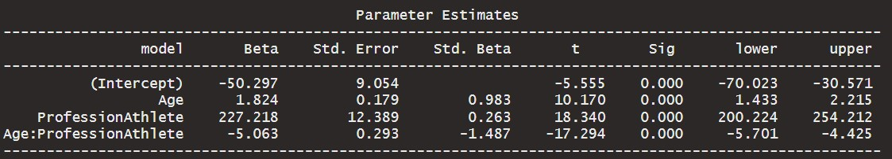
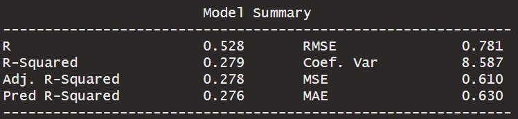
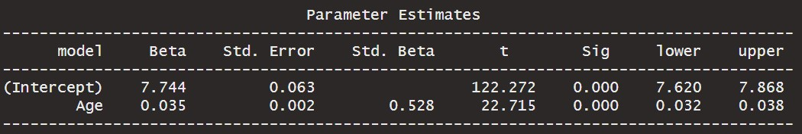
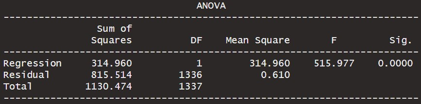
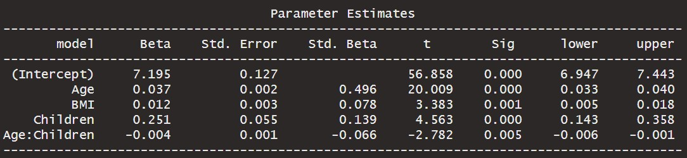
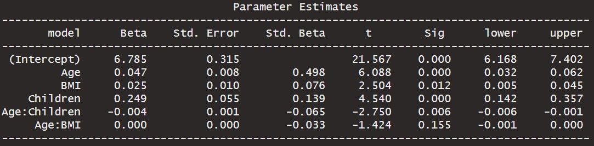
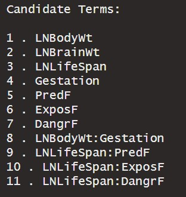
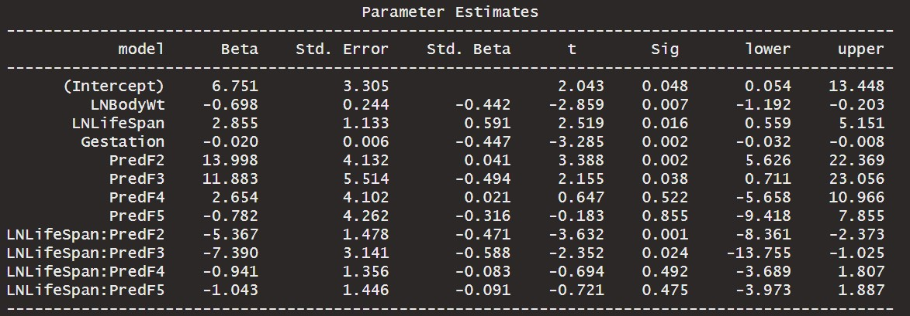

```{r setup, include=FALSE, echo=FALSE}
options(htmltools.dir.version = FALSE)
knitr::opts_chunk$set(
  fig.retina=2,
  #out.width = "75%",
  #out.height = "50%",
  htmltools.preserve.raw = FALSE,      # needed for windows
  scipen=100,                          # suppresses scientific notation
  getSymbols.warning4.0 = FALSE,       # suppresses getSymbols warnings
  cache = FALSE,
  echo = TRUE,
  hiline = TRUE,
  message = FALSE, 
  warning = FALSE
)


# install helper package (pacman)
# pacman loads and installs other packages, if needed
if (!require("pacman")) install.packages("pacman", repos = "http://lib.stat.cmu.edu/R/CRAN/")

# install and load required packages
# pacman should be first package in parentheses and then list others
pacman::p_load(pacman,tidyverse, magrittr, olsrr, gridExtra, ggiraphExtra, knitr)

# verify packages (comment out in finished documents)
p_loaded()


```

```{r xaringan-themer, include=FALSE, warning=FALSE}
library(xaringanthemer)

palette <- c(
  SU_Orange1        = "#F76900",
  SU_Orange2        = "#FF8E00",
  SU_Red_Orange     = "#FF431B",
  SU_Blue1          = "#000E54",
  SU_Blue2          = "#203299",
  SU_Light_Blue     = "#2B72D7",
  SU_White          = "#FFFFFF",
  SU_Light_Gray     = "#ADB3B8",
  SU_Medium_Gray    = "#707780",
  SU_Black          = "#000000", 
  
  steel_blue        = "#4682B4",
  corn_flower_blue  = "#6495ED",
  deep_sky_blue     = "#00BFFF",
  dark_magenta      = "#8B008B",
  medium_orchid     = "#BA55D3",
  lime_green        = "#32CD32",
  light_sea_green   = "#20B2AA",
  chartreuse        = "#7FFF00",
  orange_red        = "#FF4500",
  white_smoke       = "#F5F5F5",
  dark_cyan         = "#008B8B",
  light_steel_blue  = "#B0C4DE",
  indigo            = "#4B0082",
  ivory             = "#FFFFF0",
  light_slate_grey  = "#778899",
  linen             = "#FAF0E6",
  steel_blue        = "#4682B4",
  blue_violet       = "#8A2BE2",
  dodger_blue       = "#1E90FF",
  light_blue        = "#ADD8E6",
  azure             = "#F0FFFF",
  lavender          = "#E6E6FA")

primary_color = "#4682B4"                # steel_blue
secondary_color = "#778899"              # light_slate_grey
white_color = "#FFFFF0"                  # ivory
black_color = "#000080"                  # navy

style_duo_accent(
  primary_color = primary_color,
  secondary_color = secondary_color,
  white_color = white_color,
  black_color = black_color,
  text_color = black_color,
  header_color = primary_color,
  background_color = white_color,
  code_inline_background_color = "#E6E6FA", # lavender
  link_color = "#1E90FF",                   # dodger_blue
  code_inline_color = "#4B0082",            # indigo
  text_bold_color = "#8B008B",              # dark_magenta
  header_font_google = google_font("Open Sans"),
  text_font_google = google_font("Open Sans"),
  code_font_google = google_font("Source Code Pro"),
  colors = palette
)


```

```{r xaringan-panelset, echo=FALSE}
xaringanExtra::use_panelset()
```

```{r xaringan-tile-view, echo=FALSE}
xaringanExtra::use_tile_view()
```

```{r xaringan-fit-screen, echo=FALSE}
xaringanExtra::use_fit_screen()
```

```{r xaringan-tachyons, echo=FALSE}
xaringanExtra::use_tachyons()
```

```{r xaringan-animate-css, echo=FALSE}
xaringanExtra::use_animate_css()
```

```{r xaringan-animate-all, echo=FALSE}
#xaringanExtra::use_animate_all("slide_up")
```

background-image: url("docs_files/images/sloth_faded.png")
background-size: cover

class: bottom, right

## BUA 345 - Lecture 14

### Introduction to Model Selection

<br>


#### Penelope Pooler Eisenbies

#### `r Sys.Date()`

[Wikipedia Sloth Page](https://en.wikipedia.org/wiki/Sloth)

---

### Upcoming Dates

.pull-left[

- **HW 6 was due yesterday (3/6)** but grace period is extended until tonight at midnight.

- **HW 7 is due on Monday, 3/20**. 

   - Grace Period is extended until Wednesday 3/22 at midnight, because of Spring Break.
  
- **Quiz 2 is Thursday, March 30th**

- Thursday's Lecture (3/9) will include In-class Exercises using the Animals Data and your HW 7 data to help you make progress.

]

.pull-right[

```{r owl pic, echo=FALSE}

knitr::include_graphics("docs_files/images/owl.png")

```

]

---

### Getting Started with Markdown

- Download Zipped R project 

- Open Zipped folder and copy internal folder (R Project) to a BUA 345 folder on your computer NOT IN DOWLOADS

- Click on .Rproj file to open project

- Click on `code_data_output` file to open it.

- Click on `BUA_345_Lecture_14.Rmd` to open it.

- Run Setup Chunk

---

### Setup

* The setup chunk shows the packages needed for this demo.   

* R will install specified packages if needed (only required once after R is installed)  

* R will load specified packaged (required every time you start a new R session)  

* The first time you run this code, R will install these packages which will be slow.  

* **If you get warnings, that's okay.**  

* If you get **error messages**, I (or TA), can help you.

---

### Setup Chunk for Lecture 14

```{r setup for Lecture 14, include = T}

# this line specifies options for default options for all R Chunks
knitr::opts_chunk$set(echo=T, highlight=T)
# suppress scientific notation
options(scipen=100)

# install helper package that loads and installs other packages, if needed
if (!require("pacman")) install.packages("pacman", repos = "http://lib.stat.cmu.edu/R/CRAN/")

# install and load required packages
pacman::p_load(pacman,tidyverse, magrittr, olsrr, gridExtra, ggiraphExtra, knitr)

# verify packages
p_loaded()

```

**NOTES:

- ** Don't worry about `xaringanthemer` package (required for my slides but not for your code).

- If you are having trouble installing/loading any packages, please come to office hour or make an appointment with me or course TA.

---

### Lecture 14 In-class Exercises - Review Question

#### **Question 1 (L14) - Session ID: bua345s23**

- Recall the Actors and Athletes data that we examined in Lecture 14.

```{r celeb_prof regression, results='hide'}

# import and examine celeb profession dataset
celeb_prof <- read_csv("celeb_prof.csv", show_col_types=F) 

# formatted regression output - saved and printed to screen
(celeb_interaction_ols<- ols_regress(Earnings ~ Age + Profession + Age*Profession,
                                     data=celeb_prof, iterm = T))

```

#### Abridged Output

```{r celeb_prof param est table, echo=F}



```

---

### Lecture 14 In-class Exercises - Review Question

#### **Question 1 (L14) - Session ID: bua345s23**

#### Abridged Output

```{r celeb_prof param est table2, echo=F}


```

Review Question: Based on the regression output for the Actors and Athletes data, **what is the slope for the linear model for Athletes**?

Round answer to two decimal places.

Hint: To answer this question, you combine two terms:
-   the baseline slope term for `Age`: 1.824
-   the difference in slope `Athlete`: -5.063
-   Slope for Athletes = baseline + difference = `____`

---

### Review of Regression Terms

#### R<sup>2</sup> and Adjusted R<sup>2</sup>:

- **R** is the correlation coefficient, R<sub>XY</sub>

- **R<sup>2</sup>** is (R<sub>XY</sub>)<sup>2</sup>

- **R<sup>2</sup>** is also called coefficient of determination

- **Meaning of R<sup>2</sup> in SLR:** Proportion of variability in y explained by X

- **Adjusted R<sup>2</sup>** adjusts **R<sup>2</sup>** for number of explanatory (X) variables in model.

  -   Meaning of **Adjusted R<sup>2</sup>** in MLR is a little less specific but similar to **R<sup>2</sup>**
  
---

#### Example of R<sup>2</sup> Interpretation

#### Import and Examine Insurance Data

```{r import and examine insure_L14 data}

insure <- read_csv("insure_L14.csv", show_col_types=F) # import
insure <- insure |> # create log transformed variable
  mutate(ln_charges = log(Charges)) |> glimpse(width=75)

```

---

#### Examine Histograms of Charges and ln_charges

```{r creatingand formatting histograms of Charges and ln_charges, echo=F, fig.width=15, fig.height=8, fig.align='center'}

# histogram of original Charges data
hist_Charges <- insure |> 
  ggplot() +  
  geom_histogram(aes(x=Charges), color="darkblue", fill="lightblue") + 
  labs(x="Insurance Charges", y="Frequency") +  
  theme_classic() + 
  theme(axis.title = element_text(size=18),
        axis.text = element_text(size=15),
        plot.background = element_rect(colour = "darkgrey", fill=NA, size=2))

# histogram of ln_charges
hist_ln_charges <- insure |> 
  ggplot() +  
  geom_histogram(aes(x=ln_charges), color="darkgreen", fill="lightgreen") + 
  labs(x="Natural Log of Insurance Charges", y="Frequency") +  
  theme_classic() + 
  theme(axis.title = element_text(size=18),
        axis.text = element_text(size=15),
        plot.background = element_rect(colour = "darkgrey", fill=NA, size=2))

# display of these two histograms side by side
grid.arrange(hist_Charges, hist_ln_charges, ncol=2)

```

---

### SLR model - Predictor (X) Variable: Age

```{r slr model for insurance data, results='hide'}

# save and print slr model
(insure_slr <- ols_regress(ln_charges ~ Age, data=insure))

```

#### Abridged Output

```{r insure slr output, echo=F}





```

---

### More about R<sup>2</sup> and How It's Calculated

```{r insure slr anova output, echo = F}



```


- R = 0.528 which indicates a moderate correlation between `Age` and `ln_charges` (Natural Log of Insurance Charges)

- R<sup>2</sup> = 0.279 which means that approximately 28% of the variability in `ln_charges` (Natural Log of Insurance Charges) is explained by `Age`.

- R<sup>2</sup> can also be calculated from the Sum of Squares output:

   - **SS<sub>TOT</sub>** (Total. Sum of Squares): **1130.474 (Total variability in Y)**
  
   - **SS<sub>REG</sub>** (Regression. Sum of Squares): **314.960 (Variability in Y explained by model)**
   
   - **SS<sub>RES</sub>** (Residual Sum of Squares): **815.514 (Variability in Y NOT explained by model)**

   - **R<sup>2</sup> = SS<sub>REG</sub> / SS<sub>TOT</sub> = 314.96/1130.474 = 0.279**
   
---

### MLR with Quantitative Interaction Term

- In Lecture 14, categorical terms and interactions had a simple interpretation:

  - Each category has a unique SLR model:

     - The intercepts for different categories may or may not be different from baseline category(check P-values)

     - The slopes for different categories may or may not be different from baseline category (check P-values)
     
<br>

- There are, however, other kinds of interaction terms.

- The first one we will discuss is an interaction between two QUANTITATIVE variables.

---

### Example MLR Model with Quantitative Interaction Term

-   One POSSIBLE model for these data (there are many):

```{r insurance model iwth quantitative interaction, results='hide'}

# save and print mlr model output
(insure_mlr_quant1 <- ols_regress(ln_charges ~ Age + BMI + Children + Age*Children, data=insure))
insure_model1 <- insure_mlr_quant1$model # save model parameters to use in calculations

```

### Abridged Output

```{r insure mlr quant int output, echo=F}



```

---

### Interpreting and Evaluating Quantitative Interactions


- Two CORRECT Interpretation(s) of this interaction:

  1. The effect of age on insurance charges differs depending on how many children you have.

  2. The effect of number of children on insurance charges differs depending your age.
  
- Which interpretation the analyst emphasizes depends on the question being addressed.

<br>

- Two Questions about Evaluating Interaction Terms:

  - How do we decide if ANY interaction term should stay in the model?

  - How do we attain estimates from a model with a qunatitative interaction?
    
     Example: If a person is 48, has a BMI of 28 and has 3 children, what is the estimate of their insurance changes in dollars (NOT the LN of their charges)?
     
---

### Lecture 14 In-class Exercises - Quantitative Interactions

### Abridged Output

```{r insure mlr quant int output2, echo=F}


```

#### **Question 2 (L14) - Session ID: bua345s23**

- Based on the R MLR output shown, is the interaction between Age and Number of Children useful in explaining differences in Insurance Charges?

---

### Lecture 14 In-class Exercises - Quantitative Interactions

#### **Question 3 (L14) - Session ID: bua345s23**

- Using this model, what is estimated insurance charge for 45 year old with a BMI of 26 and 2 children? Round to closest whole dollar. 

   - Calculation can be done in R or Excel. Here are values for Excel calculation:
   
      - `Age = 45`
      - `BMI = 26`
      - `Children = 2`
      - `Age*Children = 45*2 = 90`
   
---

#### **Question 3 (L14) - Session ID: bua345s23**

- Using this model, what is estimated insurance charge for 45 year old with a BMI of 26 and 2 children? Round to closest whole dollar. 

#### Using a Saved Model in R to find an Estimate

First specify values using **EXACT** variables names in model.
`new_obs` is a one row data set (tibble) with these values.

```{r create a dataset with 1 new observation}

Age <- 45      # specify values using variable names in model
BMI <- 26
Children <- 2
new_obs <- tibble(Age, BMI, Children) # new_obs is 1 row dataset
new_obs |> kable()

```

---

#### **Question 3 (L14) - Session ID: bua345s23**

- Using this model, what is estimated insurance charge for 45 year old with a BMI of 26 and 2 children? Round to closest whole dollar. 

#### Using a Saved Model in R to find an Estimate

Next, use `mutate` to create a new column in `new_obs`.  
  - `est_ln_charges` is the estimate created using the `lm` (linear model) command with the saved model `insure_model1` and the `predict` command

```{r use model to predict estimated ln_charges for new_obs}
              
new_obs <- new_obs |>                  # create estimate_ln_charges
  mutate(est_ln_charges = lm(insure_model1) |> predict(new_obs))
new_obs |> kable()

```


The last step is to back-transform the `est_ln_charges` value to create `est_charges`, the estimate of charges in dollars for this individual.

```{r back_transform est_ln_charges to dollars}

# new_obs <- new_obs |> mutate(est_charges = ____(_____))
# new_obs |> kable()

```

---

### Lecture 14 In-class Exercises - Quantitative Interactions

#### **Question 4 (L14) - Session ID: bua345s23**

In the above model, all included terms appear to be useful to the model. Is the interaction between Age and BMI also useful in explaining the variability in insurance charges?

Examine the model output to answer this question.

```{r insure model with two quant interactions, results='hide'}

# save and print mlr model output
(insure_mlr_quant2 <- ols_regress(ln_charges ~ Age + BMI + Children + 
                                    Age*Children + Age*BMI, data=insure))

```

#### Abridged output

```{r insure mlr quant 2int output2, echo=F}



```

---

### Goodness of Fit - Adjusted R<sup>2</sup>

- Previous slides show two possible models for these data. ***There are 63 possible models*** with these X variables and all two way interactions.

- Today we will discuss **Adjusted R<sup>2</sup>** as one option to compare different models (We will cover other model comparison measures soon).
  
  - **Adjusted R<sup>2</sup>** adjusts R<sup>2</sup> DOWNWARD by adding a penalty for additional predictor variables.

    - R<sup>2</sup> (unadjusted) should NOT be used to compare MLR models.

    - Adding predictors will always increase R<sup>2</sup>, even if predictors are not useful.

    - Instead we adjust: We penalize model R<sup>2</sup> for each additional variable added.

    - Adjusted R<sup>2</sup> only increases if model fit improvement exceeds penalty for adding terms.

    - P-values for each term and change in Adjusted R<sup>2</sup> often agree (but not always)

    - As P, number of predictors increases, the penalty increases.

    - Adjusted R<sup>2</sup> = 1 - $\frac{(1-R^2)(n-1)}{n-P-1}$

**Students are not required to memorize this equation but you should understand what it is doing.**

---

### Examine All Possible Models using Adjusted R<sup>2</sup>

```{r code to examine all possible insurance models}

insure_full <- lm(ln_charges ~ Age + BMI + Children + Age*Children + # full model specified
                    Age*BMI + BMI*Children, data=insure)

insure_all_models <- ols_step_all_possible(insure_full)   # all possible models

insure_all_subset <- insure_all_models |>                 # specify model subset
  select(mindex, n, predictors, rsquare, adjr) |>         # determined based on           
  filter(mindex %in% c(1,5,6,8,10,22,42,44,47))           # understanding of data

insure_subset_print1 <- insure_all_subset |>    # format table for printing and print
  select(n, predictors, rsquare, adjr) |>       # select useful columns
  mutate(rsquare = rsquare |> round(4),         # round values to 4 decimal places
         adjr = adjr |> round(4)) |>
  
  arrange(desc(adjr)) |>                        # reorder by adjust rsquared
  rename(`No. of Predictors`= n,                # rename table columns
         Predictors = predictors,
         `R<sup>2</sup>` = rsquare,
         `Adjusted R<sup>2</sup>` =  adjr) |>
  
  kable()
```

```{r create additional kable table surted by number of predictors, echo=F}

insure_subset_print2 <- insure_all_subset |>    # format table for printing and print
  select(n, predictors, rsquare, adjr) |>       # select useful columns
  mutate(rsquare = rsquare |> round(4),         # round values to 4 decimal places
         adjr = adjr |> round(4)) |>
  rename(`No. of Predictors`= n,             # rename table columns
         Predictors = predictors,
         `R<sup>2</sup>` = rsquare,
         `Adjusted R<sup>2</sup>` =  adjr) |>
  
  kable()

```


---

### Examine All Possible Models using Adjusted R<sup>2</sup>

.pull-left[

#### Sorted by No. of Predictors

```{r table sorted by num of predictors, echo=F}

insure_subset_print2

```

]

.pull-right[

#### Sorted by Adj. R<sup>2</sup>

```{r table sorted by num of adjr2, echo=F}

insure_subset_print1

```


]

---

### Intro to Model Selection (AKA ariable Selection)

- Adjusted R<sup>2</sup> is good for comparing a few models.
- In this case we new that only 9 of the 63 possible models were reasonable.
- If there are many possible reasonable models, we automate part of the selection process.

- In MLR, the goal is to choose the simplest most accurate model, i.e. the 'BEST' set of independent variables

  - How do we decide which variables should be in our model?
  - There are many methods:
  - A popular method, **Backward Elimination**, can also be done manually in any software:

     - Start with all potential terms (including potential interaction terms) in the model and removes the least significant term one at time

  - Looking ahead, we'll also cover:

     - Foreward Selection
     - Stepwise Selection
     - 'All Possible' models - compared using additional measures

- **Common Practice:** Try multiple methods to develop preliminary final model and then tweak as needed.

---

### Steps for Backward Elimination

**`1.`** Examine Matrix of Scatterplots and histograms and determine if any transformations are needed to linearize relationships between continuous predictors and response variable.

- Optional at this stage: Also examine correlation matrix to determine if some pairs of variables will be a concern

- **New term - Multicollinearity:** If two predictors (X variables) in model have a correlation of 0.8 or higher, they can not both stay in the model because they are multicollinear and cause the model to be unstable.

**`2.`** Create a 'saturated' model with all potential predictor variables and interaction terms

- This is subjective.
- Be as transparent as possible in your how you decide on your full model.

**`3.`** Use **'Backward Elimination'** to pare model down to a preliminary model

**`4.`** Examine predictors in preliminary model to confirm they are not too highly correlated with each other.

- If two predictor variables have a correlation of 0.8 or greater, drop one of them (see above)

**`5.`** If model was modified in step 4, rerun model through Backward Elimination (not always needed).

**`6.`**  Interpret final model.

---

### Plan for This Week and HW 7

- In HW 7, you will examine the correlation matrix and then do simple versions of steps 3 and 6.
- In Lecture 14 (Today) and Lecture 15 (Thursday), we will look at a more complex example.

#### Animals Data - Question: What factors affect a mammal's sleep duration?

- Original dataset includes 56 distinct species, including man.

- Notes:

  - Two species of elephants were removed from the analysis.
  
    - Population was limited to animals under 1000 pounds.

  - Natural log (LN) transformed variables were added to original data.
  - Observations with missing values are removed below
  - Working dataset has 49 observations (49 different species)

```{r import data and remove missing values}

# import and examine data
animals <- read_csv("animals.csv", show_col_types=F) |>
  filter(!is.na(LifeSpan) & !is.na(Gestation)) 

```

---

### Glimpse of Animals Data

```{r data glimpse}

animals |> glimpse(width=75)

```

---

### Animals Data Dictionary - Description of Variables

```{r animals data dictionary table, echo=F}

Variable <- names(animals)

Type <- c("Nominal", rep("Quantitative", 8), rep("Ordinal", 3))

Description <- c("Name of Species",
                 "Total Sleep = sum of slow wave and paradoxical sleep (hrs/day)",
                 "Average Body Weight in kilograms",
                 "Natural Log of Body Weight",
                 "Average Brain Weight in grams",
                 "Natural Log of Brain Weight",
                 "Maximum Life Span in years",
                 "Natural Log of Life Span",
                 "Gestation Time in days",
                 "Predation Index (1 = least likely to be preyed upon, 5 = most likely)",
                 "Sleep Exposure Index (1 = least exposed while sleeping, 5 = most exposed",
                 "Overall Danger Index (1 = least danger from other animals, 5 = most most danger")

(animal_data_dictionary = tibble (Variable, Type, Description) |>
  kable())

```

#### Intuitvely, there is likely to be redundancy between `Predation`, `Exposure`, and `Danger`.

---
.pull-left[

### Matrix of Scatterplots 

- Like correlation matrices, scatterplot matrices are a useful way to quickly examine all possible predictors.
- First let's look at untransformed quantitative variables.

  - Notice BodyWt, BrainWt, LifeSpan plots all show observations clustered in the corner.
  - That indicates that these dsitributions are skewed and should be log transformed.
  -   Could be verified with histograms

```{r matrix 1}

animal_mat1 <- animals |> select(TotalSleep, 
                                 BodyWt, 
                                 BrainWt, 
                                 LifeSpan, 
                                 Gestation)

```

]

.pull-right[

```{r scatterplot matrix 1, out.extra='style="background-color: #3D3D3D; padding:1px;"'}

pairs(animal_mat1)

```

]

---

.pull-left[

### Scatterplot Matrix of Transformed Variables

- Next is same matrix with the LN transformed variables.

- Notice that distributions look better BUT some variables are highly correlated

  - Recall: If $R_{XY} \geq 0.8$ for two variables, they cannot both be in the model because they are **multicollinear**.

  - `LNBodyWt` and `LNBrainWt` should definitely both NOT be in the final model.

  - `LNBrainWt` and `LNLifeSpan` appear close to the cutoff and should not be in the final model together, if possible.
  
```{r matrix 2}

animal_mat2 <- animals |> select(TotalSleep, 
                                 LNBodyWt, 
                                 LNBrainWt, 
                                 LNLifeSpan, 
                                 Gestation)

```

]

.pull-right[


```{r scatterplot matrix 2, out.extra='style="background-color: #3D3D3D; padding:1px;"'}

pairs(animal_mat2)

```

]

---

### Correlation Matrix of Transformed Variables

The correlation matrix shows the numerical values of the correlations we see in the scatterplot.

```{r correlation matrix 2}

animal_mat2 |> cor() |> round(2) |> kable()

```


---

.pull-left[

### Scatterplot Matrix of Ordinal Variables

#### Lecture 14 In-class Exercises

#### **Question 4 (L14) - Session ID: bua345s23**

Which two ordinal categorical predictor variables appear to be multicollinear, i.e., highly correlated?

```{r matrix 3}

animal_mat3 <- animals |> select(TotalSleep, 
                                 Predation, 
                                 Exposure, 
                                 Danger)

```

]


.pull-right[

```{r scatterplot matrix 3, out.width=350, out.extra='style="background-color: #3D3D3D; padding:1px;"'}

pairs(animal_mat3)

animal_mat3 |> cor() |> round(2)


```

]

---

### Backward Elimination

**`1.`** Data examination and transformations completed

**`2.`** Create a full 'saturated' model with all potential predictor variables and interaction terms (This is subjective).

```{r animals full model}

 # convert ordinal variables to factors
animals <- animals |>       
  mutate(PredF = factor(Predation), 
         ExposF = factor(Exposure), 
         DangrF=factor(Danger))

# full model (subjective)
animals_full <- lm(TotalSleep ~ LNBodyWt + LNBrainWt + 
                     LNLifeSpan + Gestation + 
                     PredF + ExposF + DangrF + 
                     LNBodyWt*Gestation + LNLifeSpan*PredF + 
                     LNLifeSpan*ExposF + LNLifeSpan*DangrF, data=animals)

```

---

### Backward Elimination

**`3.`** Use 'Backward Elimination' to pare full model down to a preliminary model.

- We cast a ***wide net*** to start by specifying that erms will remain in model if p-value < 0.1.  

```{r animals model backward elim and output, results='hide'}

(animals_BE <- ols_step_backward_p(animals_full, prem = 0.1, progress = T))

```

```{r BE candidate terms, echo=FALSE, out.height=200}



```

```{r BE elim summary, echo=FALSE}

knitr::include_graphics("docs_files/images/animals_BE_elim_smry.jpg")

```

---

### Backward Elimination - Preliminary Model  

- Note that each category of each factor variable is shown making model look more complex than it is.

```{r anaimals BE param table, echo=F}

knitr::include_graphics("docs_files/images/animals_BE_mlr2.jpg")

```

---

### Backward Elimination - Next Steps

**`4.`** Examine predictors in preliminary model to confirm they are not too highly correlated with each other. 

- If correlation for two variables, $R_{XY} \geq 0.8$, then one variable should be excluded.

- Variables in preliminary model: : `LNBodyWt`, `LNLifeSpan`, `Gestation`, `PredF`, `DangrF`, `LNLifeSpan*PredF`

  - Recall that `PredF` (Predation) and `DangrF` (Danger) are highly correlated.
  - `PredF` is included in an interaction term so exclude `DangrF`.

**`5.`** If model was modified in Step 4, rerun model through Backward Elimination (not always needed).

**`6.`**  Interpret final model. 

- Adjusted R<sup>2</sup> = 0.655
- Model below looks complicated, but each animal is in only one Predation Category.
- Baseline Predation Category = 1


```{r final animal model, results='hide'}
# specify final model
(animals_final <- ols_regress(TotalSleep ~ LNBodyWt + LNLifeSpan + Gestation + 
                               PredF + LNLifeSpan*PredF, data=animals))
# save coefficients
animals_model <- animals_final$model

```


---

### Backwards Elimination - Animal Data Final Model

```{r animal final param table, echo=F}



```


---


### Using Model to Find Estimates - Exporting Model and Data to Excel

- This model can be used to find model estimates and residuals for all animals.

- We will **ALSO** do these calculations are done in an Excel Spreadsheet to clarify each model component in estimate.

- Below we export the data for three species to examine how the model works

```{r exporting data to excel for demo}
animals_model_data <- animals |>             # create new dataset with model variables only
  select(Species, TotalSleep, LNBodyWt, LNLifeSpan, Gestation, PredF)

three_species <- animals_model_data |>       # create mini dataset with three species
  filter(Species %in% c("Baboon", "Donkey", "ArcticFox")) |>
  write_csv("ThreeSpecies.csv")

```

```{r display exported data, echo=F}

three_species |> kable()

```

---

### Using Model to Find Estimates - Exporting Model and Data to Excel

.pull-left[


- Model coefficients for calculations can be extracted and exported to Excel.

- Below We create a two column dataset listing each model component and it's beta coefficient.

- That dataset is exported as a .csv file for an in-class exercise.

```{r export model betas}

# examine and export model betas for worksheet
beta <- animals_final$betas
model_term <- names(beta)
animal_betas <- tibble(model_term, beta) |> 
    write_csv("animal_betas.csv")

```

#### Lecture 14 In-class Exercises
#### **Question 5 (L14) - Session ID: bua345s23**

What is the regression estimate of total sleep for 'Donkey'?

]

.pull-right[

```{r examine model betas table, echo=F}

animal_betas |> kable()

```

]


---

### Using Model to Find Estimates in R

- Model estimates can be calculated in R.

- The Excel Worksheet is used to demonstrate and clarify how those estimates are calculated.

- Students will be expected to calculate an estimate using a model with this level of complexity on Quiz 2.

```{r regression model estimates in R}
animals_model_data <- animals_model_data |>     # add model estimates to data
  mutate(Est_TotalSleep = lm(animals_model) |> 
           predict(animals_model_data) |> round(2))

animals_model_data <- animals_model_data |>          # calculate residuals
  mutate(Resid = TotalSleep - Est_TotalSleep) |>
  relocate(Est_TotalSleep, Resid, .after=TotalSleep) # reorder variables

head(animals_model_data, 4) |> kable()               # print first 4 rows

```

---

### Reminder of Upcoming Dates

.pull-left[

- **HW 6 was due yesterday (3/6)** but grace period is extended until tonight at midnight.

- **HW 7 is due on Monday, 3/20**. 

   - Grace Period is extended until Wednesday 3/22 at midnight, because of Spring Break.
  
- **Quiz 2 is Thursday, March 30th**

- Thursday's Lecture (3/9) will include In-class Exercises using the Animals Data and your HW 7 data to help you make progress.

]

.pull-right[

```{r owl pic2, echo=FALSE}

knitr::include_graphics("docs_files/images/owl.png")

```

]

---

background-image: url("docs_files/images/tired_panda_faded.png")
background-size: cover

.pull-left[

### **Key Points from Today**

.bg-azure.b--dark_cyan.ba.bw2.br3.shadow-5.ph2[

- Regression modeling can be overwhelming 

  - Too many options

- Automating part of the variable selection process is helpful.

  - Should not be attempted in Excel.

- Result from Automated process is preliminary.
  
  - Analyst should tinker with these results.

- Backward Elimination is one effective method of model selection.
   - We will cover others.

]

]

.pull-right[

.bg-azure.b--dark_cyan.ba.bw2.br3.shadow-5.ph3[
You may submit an 'Engagement Question' about each lecture until midnight on the day of the lecture. **A minimum of four submissions are required during the semester.**
]

]


